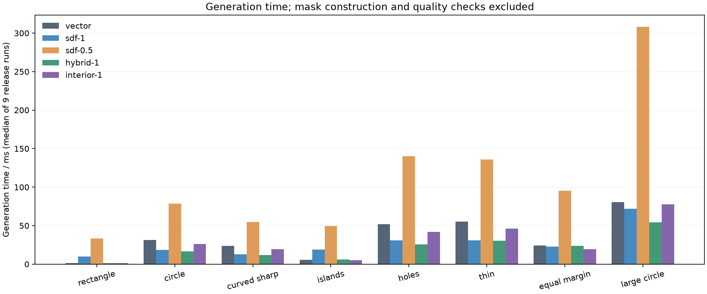
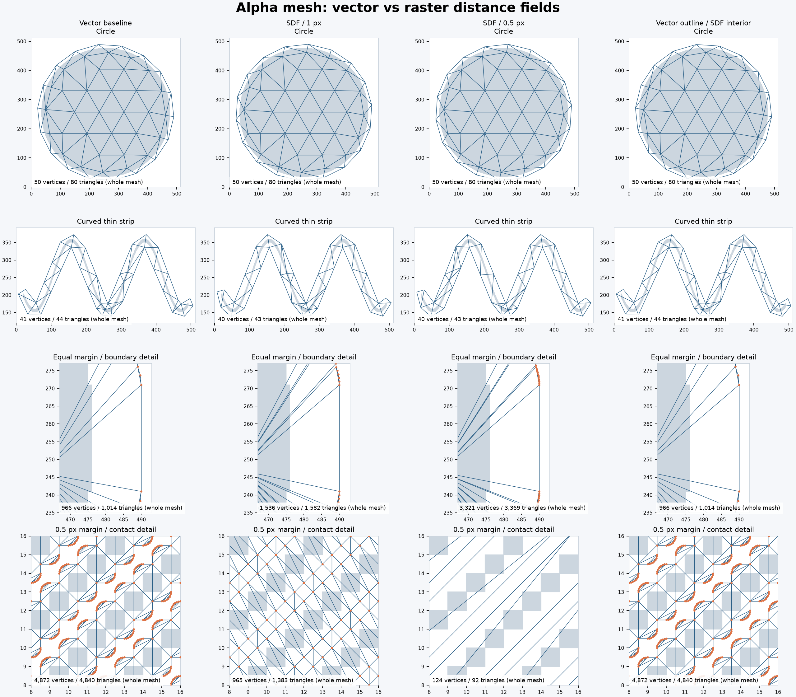

# Alpha mesh SDF 实验归档

2026 年 10 月 10 日。结论：**运行代码只保留第一轮拓扑查询与布点优化，SDF buffer 替代方案归档，不进入 SDK API 或构建 feature。** SDF 在部分复杂轮廓上更快，但没有同时达到简化实现、稳定提速和保持网格质量的目标。

## 保留的第一轮优化

第一轮保留矢量轮廓、`geo::Buffer`、保守简化和 CDT，针对查询与布点做了以下调整：

- CDT 面分类改为从外侧遍历相邻面，仅跨真实轮廓边时翻转内外；内部支撑约束不作为孔洞。后续插点拆分边界后，重新追踪原边界的子边。
- 支撑链简化后的合法性改为沿 CDT 局部检查，跳过未改变的链，替代全局多边形包含查询。
- 内部 lattice 对齐源图坐标；可选支撑点和填充点共用占位网格，在 f32 量化后检查间距。支撑链端点与分支连接点先保留，再过滤可选点。
- 增加边界拆分、嵌套孔洞、局部路径、网格对齐、细分支支撑和极小 spacing 的回归检查。

与原提交 `8c7ce55` 相比，第一轮 release 基准中 `islands` 从 192.000 ms 降至 5.727 ms（约 33.5 倍），`equal_margin` 从 150.754 ms 降至 25.421 ms（约 5.9 倍）。其余场景没有一致提速，顶点数量也有少量变化。原始结果保存在 [优化前](first-round-before.csv) 和 [优化后](first-round-after.csv)，均为每例 9 次的中位数；不要与后续 SDF 批次的时间直接混算。

保留的基准入口：

```sh
cargo run --release --locked -p kasane-sdk --example alpha_mesh_profile -- 9
```

## SDF 实验范围

本次只替换现有流程中的 buffer 运算，并未实现从 alpha mask 到 CDT 的完整 SDF 流水线。原型先栅格化多边形，以栅格像素方块边界构建距离场，再用 marching squares 提取外扩或内缩等值线。距离变换在该栅格表示上计算；非栅格轮廓的栅格化和等值线插值仍有近似误差。

原型支持轮廓包围盒裁剪、两份近期距离场缓存和采样预算。矢量布尔运算、保守简化及其检查仍然存在，因此它增加了后端、缓存和拓扑处理代码，尚未实现最初设想的整体代码缩减。

| CSV 后端 | 配置 |
| --- | --- |
| `vector` | 第一轮优化后的矢量基线 |
| `sdf-1` | 全部非零 buffer 使用 1px 栅格 |
| `sdf-0.5` | 全部非零 buffer 使用 0.5px 栅格 |
| `hybrid-1` | 1px 栅格；当输入每个环均不超过 64 条边时使用矢量 buffer |
| `interior-1` | 外轮廓构造与简化保持矢量，仅内部阶段使用上述混合后端 |

所有配置中，零距离直接保留输入几何。因此 `zero_margin` 用例通过不能单独证明 SDF 零等值线的像素边界精度。

## 性能结果

同一批次共 13 个确定性合成输入、5 种配置，每例预热后测量 9 次。下表为总建网时间中位数，单位 ms，包含 buffer 在内的全部生成过程，不包含输入构造、面积质量检查和文件导出。环境为 macOS arm64、Rust 1.99.0，完整信息见 [run.json](run.json)，全部结果见 [comparison.csv](comparison.csv)。

| 输入 | 矢量 | SDF 1px | SDF 0.5px | 混合 1px | 仅内部 1px |
| --- | ---: | ---: | ---: | ---: | ---: |
| rectangle | 1.208 | 9.937 | 33.341 | 1.318 | 1.185 |
| circle | 31.419 | 18.393 | 78.412 | 16.407 | 26.367 |
| holes | 51.723 | 31.110 | 140.412 | 25.449 | 41.872 |
| thin | 55.451 | 30.745 | 135.817 | 30.535 | 46.118 |
| equal_margin | 24.367 | 22.636 | 95.351 | 23.720 | 19.257 |
| islands | 5.499 | 18.848 | 49.537 | 6.029 | 5.327 |
| large_circle | 80.527 | 71.716 | 308.016 | 54.141 | 77.743 |
| edge_clipped | 14.592 | 10.703 | 43.631 | 8.417 | 12.755 |

1px SDF 对圆、孔洞和曲线细条有收益，但矩形和多岛输入明显退化。0.5px 栅格在这些输入中更慢。混合后端缓解简单轮廓的开销；仅内部替换在 circle、holes、thin、equal_margin 上约减少 16%–21% 的时间，但收益不足以抵消本轮新增的实现复杂度。



## 网格质量与失败用例

`equal_margin` 的 `minimum_margin` 等于 `outside_margin`，本来就是边界简化余地很小的场景。SDF 引入的边界近似使这一场景更加密集：

| 配置 | 顶点 | 三角形 | 最小角度 | 最小角小于 10° 的三角形 |
| --- | ---: | ---: | ---: | ---: |
| 矢量 | 966 | 1,014 | 0.6776° | 86.79% |
| SDF 1px | 1,536 | 1,582 | 0.2457° | 93.05% |
| SDF 0.5px | 3,321 | 3,369 | 0.0439° | 96.97% |

面积检查以独立构造的 `geo::Buffer` 矢量结果作为参考，单位为 px²。65 次配置与输入组合均成功生成，前景漏覆盖量在 CSV 六位小数精度下均为零；这不等于余量和拓扑完全一致。

- `equal_margin` 的最小余量缺失面积由矢量的 0.001613 增至 SDF 1px 的 0.169433；超出最大余量参考域的面积由 0.004422 增至 56.743929。0.5px 的两项分别为 0.021840 与 56.878571，精细栅格没有同时改善所有指标。
- `diagonal_half_margin` 使用对角排列像素与 0.5px 余量。矢量有 4,872 个顶点，SDF 1px 为 965 个，SDF 0.5px 为 124 个；0.5px 的最小余量缺失面积达到 33.713438。顶点骤减伴随接触处轮廓和拓扑的明显变化，不能解释为更好的简化。
- `interior-1` 在这 13 个输入中保留了矢量基线的外域面积结果，内部点位置和数量仍可能改变，例如 `large_circle` 顶点数从 162 增至 166。

面积参考自身包含矢量圆弧离散化和输出 f32 量化误差，不能直接当作解析欧氏距离的严格误差界。矢量基线在 holes、thin 上也已有较大的超出参考域面积（分别约 2307 与 2536 px²），因此不能将 SDF 的绝对超出量全部归因于新后端。



已有 35 项 alpha mesh 合约测试的结果如下；通过合约测试仍不能排除上面的面积及质量差异。

| 配置 | 通过 | 失败 |
| --- | ---: | ---: |
| 矢量 | 35 | 0 |
| SDF 1px | 35 | 0 |
| SDF 0.5px | 34 | 1 |
| 混合 1px | 35 | 0 |
| 仅内部 1px | 35 | 0 |

0.5px 失败项为 `collapsed_insets_have_distributed_support_in_isolated_and_attached_strips`，孤立细条的 `190..236` 区间缺少支撑，详见 [失败日志](contracts-sdf-0.5.log)。本轮没有通过改弱断言或出错时偷偷退回矢量来消除此失败。

这些都是合成输入；三角形角度和覆盖面积是几何指标，不能替代真实 PSD 图层或变形动画质量验证。

## 归档与恢复

当前运行代码已移除 SDF 模块、buffer 适配层、feature、实验 API、环境变量测试入口和实验脚本。`domain.rs`、`simplify.rs`、SDK 导出及 Cargo feature 恢复原状；第一轮实现、回归测试和基础性能示例保留。

[experiment.patch](experiment.patch) 保存从本归档所在提交的第一轮代码到实验代码的完整增量，包含实验后端、测试接线、13 用例基准及绘图脚本。补丁已在临时目录实际应用，12 个恢复文件逐字节匹配归档前快照；文件校验值见 [snapshot.json](snapshot.json)。图表、CSV、环境元数据和五组测试日志直接保存在本目录。每个网格的 JSON 可用恢复后的基准重新生成。

需要重现实验时，在独立检出中恢复，避免把实验代码带回主线：

```sh
archive_commit=$(git log -1 --format=%H -- docs/archive/experiments/alpha-mesh-sdf/README.md)
git worktree add --detach ../kasane-alpha-sdf-repro "$archive_commit"
cd ../kasane-alpha-sdf-repro
git apply --check docs/archive/experiments/alpha-mesh-sdf/experiment.patch
git apply docs/archive/experiments/alpha-mesh-sdf/experiment.patch
uv run --locked python tools/alpha_mesh_sdf_bench.py --contracts
uv run --locked --with matplotlib python tools/alpha_mesh_sdf_plot.py
```

基准脚本会记录已知的合约失败，而不会因此隐藏其他配置的结果。恢复后输出位于 `target/alpha-sdf/`。若未来重启 SDF 方向，优先解决亚像素余量与对角接触语义，再评估是否值得整体替换 mask 到轮廓的流程；本轮数据不支持直接用 SDF 替换所有 buffer。

归档回退后验证：SDK release 测试 98 项通过，编辑器 `mesh_generation` 接入测试 8 项通过，Rust 格式检查和 Git diff 空白检查通过。
